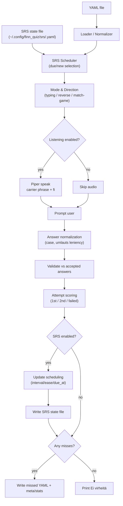

# finn_quiz.rb

A tiny command-line Finnish vocabulary quizzer that reads words from a YAML file and quizzes you in multiple modes:

- **typing** (English shown → you type Finnish)
- **reverse (fi→en)** (Finnish shown or spoken → you type English)
- **match-game** (guided recall; 3 hints are shown, but you still type the answer)
- **listening** (Finnish is spoken via **Piper**; Finnish text is hidden)
  - `--listen` : Finnish is spoken, English is shown
  - `--listen-no-english` : Finnish is spoken, English is hidden (hard mode)

---

## Mode Examples (Weather YAML)

Below are example interactions using the weather vocabulary file.

### Typing mode (default)

Command:

```bash
ruby finn_quiz.rb weather.yaml
```

Example session:

```text
Finnish Quiz — 5 word(s) (mode: typing)
--------------------------------------------------

[1/5] English: It’s cloudy.
Type the Finnish word: on pilvistä
✅ Oikein!
   (phonetic: On PIL-vis-ta)
```

---

### Reverse mode (fi → en)

Command:

```bash
ruby finn_quiz.rb weather.yaml --reverse
```

Example session:

```text
Finnish Quiz — 5 word(s) (mode: typing, fi→en)
--------------------------------------------------

[1/5] Finnish: On pakkasta.
Type the English meaning: It’s below zero.
✅ Correct!
```

---

### Match-game mode

Command:

```bash
ruby finn_quiz.rb weather.yaml --match-game
```

Example session:

```text
Finnish Quiz — 5 word(s) (mode: match-game)
--------------------------------------------------

[1/5] English: It’s snowing.
Hints:
  - Sataa lunta.
  - On pilvistä.
  - On kuuma.
Type the Finnish word: sataa lunta
✅ Oikein!
   (phonetic: SA-taa LUN-ta)
```

---

### Listening mode (`--listen`)

Command:

```bash
ruby finn_quiz.rb weather.yaml all --listen
```

Example session:

```text
Finnish Quiz — 5 word(s) (mode: typing, listen)
--------------------------------------------------

[1/5]
Audible Finnish: (listening…)
English: ["It’s windy."]
(Type 'r' to replay audio)
Type what you heard (Finnish): tuulee
✅ Oikein!
   (phonetic: TUU-lee)
```

---

### Listening mode (hard mode: `--listen-no-english`)

Command:

```bash
ruby finn_quiz.rb weather.yaml all --listen-no-english
```

Example session:

```text
Finnish Quiz — 5 word(s) (mode: typing, listen-no-english)
--------------------------------------------------

[1/5]
Audible Finnish: (listening…)
(Type 'r' to replay audio)
Type what you heard (Finnish): on kylmä
✅ Oikein!
   (phonetic: On KÜL-mä)
```

---

### Combined example (reverse + listening + match-game)

This is the “full stack” drill: you **hear Finnish**, get **3 hints**, and you must type the **English** meaning.

**Tip**: in reverse + match-game, use `--match-options both` to show each hint as a Finnish → English mapping (otherwise you may only see Finnish hints).

Command:

```bash
ruby finn_quiz.rb weather.yaml all --reverse --listen --match-game --match-options both
```

Example session:

```text
Finnish Quiz — 5 word(s) (mode: match-game, listen, fi→en)
--------------------------------------------------

[1/5]
Audible Finnish: (listening…)
Hints (fi → en):
  - On pakkasta. → It’s below zero.
  - On kuuma. → It’s hot.
  - On pilvistä. → It’s cloudy.
(Type 'r' to replay audio)
Type the English meaning: It’s below zero.
✅ Correct!
```

---

## Architecture Overview

At a high level, the script is a pipeline:

1) Load vocabulary (YAML) → normalize entries  
2) Choose mode + question/answer direction  
3) (Optional) speak Finnish via Piper  
4) Prompt → validate input → score attempts  
5) Write “missed” YAML only if needed

### Dataflow (conceptual)



### Mode layering (how flags combine)

```text
Base loop:            prompt → validate → score
+ --match-game:       add 3 hints (distractors) to each prompt
+ --reverse:          swap Q/A direction (fi→en)
+ --listen / --listen-no-english:
                      speak Finnish (and optionally hide English)
```

It tracks how many you got correct on the **1st** vs **2nd** try, and writes a “missed words” YAML file **only if you missed something**.

---

## 🚀 Quick Start

### 1. Run a basic quiz (no audio)

```bash
ruby finn_quiz.rb Example_yaml/finnish_days_of_week.yaml
```

Run a subset or all words:

```bash
ruby finn_quiz.rb Example_yaml/finnish_days_of_week.yaml 5
ruby finn_quiz.rb Example_yaml/finnish_days_of_week.yaml all
```

### 2. Run match-game mode

```bash
ruby finn_quiz.rb Example_yaml/finnish_days_of_week.yaml --match-game
```

### 3. Run listening mode (requires Piper)

If you have Piper installed and a Finnish voice model downloaded:

```bash
ruby finn_quiz.rb Example_yaml/finnish_days_of_week.yaml all \
  --listen-no-english \
  --match-game \
  --piper-bin /Users/you/venvs/piper/bin/piper \
  --piper-model /Users/you/tools/piper/models/fi_FI/harri/medium/fi_FI-harri-medium.onnx
```

Tip: you can press `r` during listening mode to replay the audio.

---

## Requirements

### Core
- **Ruby**: modern Ruby (tested with Ruby 4.x; Ruby 3.x should also be fine)
- **No external Ruby gems required** — standard library only:
  - `yaml`
  - `time`
  - `optparse`
  - `securerandom`

### Text-to-Speech (optional)
Listening modes require:
- **Piper TTS** (`piper` CLI)
- A **Piper voice model** (`.onnx` + matching `.onnx.json`)

---

## Install / Run

From the directory containing `finn_quiz.rb`:

```bash
ruby finn_quiz.rb path/to/words.yaml
```

Use a subset of words or all words:

```bash
ruby finn_quiz.rb path/to/words.yaml 10
ruby finn_quiz.rb path/to/words.yaml all
```

---

## Modes

### Typing mode (default)

```bash
ruby finn_quiz.rb words.yaml
```

You’ll see English and type Finnish.

### Reverse mode (Finnish → English)

Practice translating Finnish into English:

```bash
ruby finn_quiz.rb words.yaml --reverse
```

Combine with listening:

```bash
ruby finn_quiz.rb words.yaml all --reverse --listen --match-game
```

In reverse mode, English may accept multiple forms (e.g., `20` or `twenty`) if defined in the YAML.

### Match-game mode

Shows **three Finnish hints**, but you still **type** the answer (guided recall rather than multiple choice).

```bash
ruby finn_quiz.rb words.yaml --match-game
```

### Listening mode (Finnish is spoken; text hidden)

**Listening with English shown**:

```bash
ruby finn_quiz.rb words.yaml all --listen \
  --piper-bin /path/to/piper \
  --piper-model /path/to/fi_FI-voice.onnx
```

**Listening with English hidden (hard mode)**:

```bash
ruby finn_quiz.rb words.yaml all --listen-no-english \
  --piper-bin /path/to/piper \
  --piper-model /path/to/fi_FI-voice.onnx
```

#### Tip: why we use a “carrier phrase”
Some TTS engines (including Piper) can sound odd on isolated single words (e.g., `ei`). In listening mode the script speaks a short phrase like:

> `Suomeksi: <word>.`

That improves naturalness and intelligibility.

---

## Options

### Word count / subsets

By default, the quiz uses the **entire** YAML set. You can also quiz a **subset** by passing a second argument:

```bash
ruby finn_quiz.rb path/to/words.yaml 5    # quiz 5 random entries
ruby finn_quiz.rb path/to/words.yaml 20   # quiz 20 random entries
ruby finn_quiz.rb path/to/words.yaml all  # explicit: use all entries
```

The word count argument works with any mode and can be combined with flags such as --match-game, --reverse, and --listen.

## Options Summary

| Flag | Purpose | Works With | Default |
|------|---------|------------|---------|
| `--reverse` | Finnish → English mode | typing, match-game, listen | off |
| `--match-game` | Guided recall with 3 hints | typing, reverse, listen | off |
| `--match-options MODE` | Control hint display in reverse match-game mode | reverse + match-game | `auto` |
| `--listen` | Speak Finnish (English shown) | typing, match-game | off |
| `--listen-no-english` | Speak Finnish (English hidden) | typing, match-game | off |
| `--lenient-umlauts` | Accept `a/o` for `ä/ö` | typing only | off |
| `--piper-bin PATH` | Path to Piper binary | listen modes | required |
| `--piper-model PATH` | Path to voice model | listen modes | required |
| `--srs` | Enable spaced repetition scheduling | any mode | off |
| `--due` | With `--srs`, only quiz due items | `--srs` | off |
| `--new N` | With `--srs`, include up to N new items per session | `--srs` | 5 |
| `--reset-srs` | With `--srs`, reset scheduling state for this pack | `--srs` | off |
| `--srs-file PATH` | Override SRS state file location | `--srs` | default path |


### `--lenient-umlauts`
Allows `a` for `ä` and `o` for `ö` (useful early on). If you use the lenient spelling, you still get credit, but it reminds you that umlauts matter.

```bash
ruby finn_quiz.rb words.yaml --lenient-umlauts
```

### `--match-game`
Enable match-game mode:

```bash
ruby finn_quiz.rb words.yaml --match-game
```

### `--match-options MODE`
Control how hints are displayed in reverse match-game mode.

```bash
--match-options auto   # default
--match-options en     # show English hints only
--match-options both   # show Finnish → English mapping hints
```

Example (reverse mode with both):

```
Hints:
  - kaksituhatta → 2000
  - viisikymmentä → 50
  - kaksikymmentäyksi → 21
```

### `--listen` / `--listen-no-english`
Enable listening mode. Requires Piper + a voice model.

```bash
ruby finn_quiz.rb words.yaml --listen --piper-bin ... --piper-model ...
ruby finn_quiz.rb words.yaml --listen-no-english --piper-bin ... --piper-model ...
```

### `--piper-bin PATH` / `--piper-model PATH`
Provide Piper and model paths explicitly:

```bash
ruby finn_quiz.rb words.yaml all --listen   --piper-bin /Users/you/venvs/piper/bin/piper   --piper-model /Users/you/tools/piper/models/fi_FI/harri/medium/fi_FI-harri-medium.onnx
```

You can also set environment variables instead of passing flags every time:

```bash
export PIPER_BIN="$HOME/venvs/piper/bin/piper"
export PIPER_MODEL="$HOME/tools/piper/models/fi_FI/harri/medium/fi_FI-harri-medium.onnx"
```

Then run:

```bash
ruby finn_quiz.rb words.yaml all --listen-no-english --match-game
```

---

## macOS: Make Piper Environment Variables Persistent (zsh)

On macOS, the default shell is `/bin/zsh`.
If you only run `export ...` in a terminal, those variables exist **only for that session**.

To make them available in all new terminal windows/tabs:

### 1. Confirm your shell

```bash
echo $SHELL
```
If it returns `/bin/zsh`, continue.

### 2. Add the variables to your shell config

Edit your zsh configuration:

```code
nano ~/.zshrc
```
add: 

```code
export PIPER_BIN="$HOME/venvs/piper/bin/piper"
export PIPER_MODEL="$HOME/tools/piper/models/fi_FI/harri/medium/fi_FI-harri-medium.onnx"
```

Reload:

```code
source ~/.zshrc
```
Optional: Ensure IDE / login-shell support

Some macOS setups and IDEs (e.g., JetBrains) use login shells.

To ensure the variables are available everywhere, also add the same lines to:

```code
nano ~/.zprofile
```

Verify

Open a new terminal and run:

```bash
echo $PIPER_BIN
echo $PIPER_MODEL
```

If both print correctly, your environment is set.

---

## How many attempts?

The script currently allows **2 attempts per word**:

- “Correct 1st” → got it on attempt 1
- “Correct 2nd” → got it on attempt 2
- Miss both → **Failed** and recorded to the missed list

To change this later, look for:

```ruby
1.upto(2) do |attempt|
```

---

## YAML format

The script supports **two YAML shapes**:

1) **Mapping (Hash)** form (recommended)
2) **List (Array)** form

Each entry needs:
- English: `en` (or hash key in mapping form)
- Finnish: `fi`
- Optional: `phon` (phonetic hint)

### Finnish can be a string *or a list* (synonyms supported)

```yaml
- en: "It’s sunny."
  fi:
    - "Aurinko paistaa."
    - "On aurinkoista."
  phon: "AU-rin-ko PAI-staa / On AU-rin-kois-ta"
```

When an entry has multiple acceptable Finnish answers, the quiz accepts any of them and, after a correct answer, prints:

- `Also accepted: ...`

### 1) Mapping (Hash) form (recommended)

```yaml
Monday:
  fi: maanantai
  phon: MAAN-AHN-TAI

Weekend:
  fi:
    - viikonloppu
    - viikonloppuna
  phon: VEE-KON-LOP-PU / VEE-KON-LOP-PU-na
```

### 2) List (Array) form

```yaml
- en: Monday
  fi: maanantai
  phon: MAAN-AHN-TAI

- en: Weekend
  fi: viikonloppu
  phon: VEE-KON-LOP-PU
```

---

## Output files (missed words)

If you miss at least one word, the script writes:

```
<base>_missed_YYYYMMDD_HHMMSS.yaml
```

Example:

```
finnish_days_of_week_missed_20260218_082428.yaml
```

If you miss nothing, it prints:

```
😊 Ei virheitä — hienoa työtä!
```

…and **no file is written**.

Missed-file payload includes:
- `meta` (timestamp, source file, flags)
- `stats`
- `missed` (the missed entries)

---

## Example sessions

### Match-game (typing)

```text
Finnish Quiz — 8 word(s) (mode: match-game)
--------------------------------------------------

[1/8] English: Thursday
Hints:
  - keskiviikko
  - viikonloppu
  - torstai
Type the Finnish word: torstai
✅ Oikein!
   (phonetic: TORS-TAI)

--------------------------------------------------
Results
Total: 8
Correct 1st: 6 (75.0%)
Correct 2nd: 2 (25.0%)
Failed: 0 (0.0%)

😊 Ei virheitä — hienoa työtä!
```

### Listening + match-game (no English)

```text
Finnish Quiz — 8 word(s) (mode: match-game, listen-no-english)
--------------------------------------------------

[1/8]
Audible Finnish: (listening…)
Hints:
  - maanantai
  - tiistai
  - viikonloppu
Type what you heard (Finnish): viikonloppu
✅ Oikein!
   (phonetic: VEE-KON-LOP-PU)

--------------------------------------------------
Results
Total: 8
Correct 1st: 7 (87.5%)
Correct 2nd: 1 (12.5%)
Failed: 0 (0.0%)
```

---

## Piper TTS setup

### Where Piper lives (project + ecosystem)
- Piper development is maintained at **https://github.com/OHF-Voice/piper1-gpl** 
- `piper-tts` is distributed on PyPI and installs a `piper` CLI tool
### macOS (recommended): install via Python venv + pip

```bash
python3 -m venv ~/venvs/piper
source ~/venvs/piper/bin/activate
python -m pip install -U pip
pip install piper-tts
piper --help | head
```

Your Piper executable will typically be:

- `~/venvs/piper/bin/piper`

### Windows (recommended): install via Python venv + pip

In PowerShell:

```powershell
py -m venv $HOME\venvs\piper
$HOME\venvs\piper\Scripts\Activate.ps1
python -m pip install -U pip
pip install piper-tts
piper --help
```

Your Piper executable will typically be:

- `%USERPROFILE%\venvs\piper\Scripts\piper.exe` (or `piper` script)

> Note: This Ruby script currently uses macOS `afplay` for audio playback.
> For Windows, you’ll need to either:
> - run Piper to produce WAV and play it with PowerShell, or
> - patch `piper_speak` to use a Windows player.
>
> PRs welcome — the architecture already cleanly isolates playback in `piper_speak`.

### Downloading voice models

A Piper model is **two files**:
- `*.onnx`
- `*.onnx.json` (matching config)

The canonical model collection is **rhasspy/piper-voices** on Hugging Face. 

#### Example: Finnish (fi_FI) — Harri (medium)
Files live under:

- `fi/fi_FI/harri/medium/` 

Download both files into a directory, e.g.:

```bash
mkdir -p ~/tools/piper/models/fi_FI/harri/medium
cd ~/tools/piper/models/fi_FI/harri/medium

curl -L -o fi_FI-harri-medium.onnx \
  "https://huggingface.co/rhasspy/piper-voices/resolve/main/fi/fi_FI/harri/medium/fi_FI-harri-medium.onnx"

curl -L -o fi_FI-harri-medium.onnx.json \
  "https://huggingface.co/rhasspy/piper-voices/resolve/main/fi/fi_FI/harri/medium/fi_FI-harri-medium.onnx.json"
```

Smoke test:

```bash
echo "Ei kiitos." | piper -m ~/tools/piper/models/fi_FI/harri/medium/fi_FI-harri-medium.onnx -f /tmp/test.wav
afplay /tmp/test.wav
```

---

## Spaced Repetition System (SRS)

This project includes an optional Spaced Repetition System (SRS) inspired by the SM-2 algorithm used in Anki and SuperMemo.

### What Is SRS?

SRS schedules review of words based on how well you remember them. Words you struggle with appear more frequently. Words you answer easily are shown less often over time.

This prevents over-reviewing easy vocabulary while ensuring difficult words return before you forget them.

### How It Works Here

Each word stores the following data locally:

- `reps` — number of successful reviews in a row
- `interval_days` — current spacing interval
- `ease` — growth multiplier
- `due_at` — next scheduled review time
- `lapses` — number of times forgotten

Performance rules:

- Correct on 1st try → interval increases
- Correct on 2nd try → interval increases (slightly less)
- Failed → reset and scheduled again in ~10 minutes

Intervals typically grow like:

`1 → 6 → 15 → 35 → 80 → 180 days…`

### Where Data Is Stored

By default:
```text
~/.config/finn_quiz/srs/<pack_name>.yaml
```

You can override this location with:
```text
--srs-file PATH
```

### Using SRS

Enable scheduling:

```bash
ruby finn_quiz.rb pack.yaml all --srs
```
Only review due items: 

```bash
ruby finn_quiz.rb pack.yaml all --srs --due
```

Limit new words per session:

```bash
ruby finn_quiz.rb pack.yaml all --srs --new 10
```
Reset scheduling for a pack:

```bash
ruby finn_quiz.rb pack.yaml all --srs --reset-srs
```
### Session Header

When SRS is enabled, the session begins with a status summary:
```text
SRS Status — Due: 12 | New: 5
```

---

## Troubleshooting

### “Not enough distractors.”
In match-game mode, the script needs enough **unique** Finnish words in the pool to generate distractors.

Fix: add more vocabulary, or run match-game only on a larger YAML set.

### “Piper binary not found” (common in IDEs)
If you run from IntelliJ/JetBrains IDEs, your shell `export` variables may not carry over.

Fix:
- Set `PIPER_BIN` and `PIPER_MODEL` in the IDE Run Configuration environment, **or**
- Pass `--piper-bin` and `--piper-model` directly as flags.

---

## License / Notes

Personal utility script. Adjust as you like. Kiitos & have fun learning 🇫🇮
